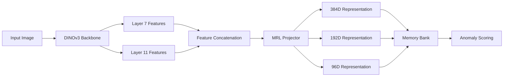

# Mat-AD: Matryoshka Anomaly Detection Framework


**Mat-AD** is a novel anomaly detection framework that leverages Matryoshka Representation Learning (MRL) with DINOv3 features for efficient industrial inspection. Inspired by Matryoshka Representation Learning (MRL) (Kusupati et al. 2022), our approach learns hierarchical representations that enable flexible inference at multiple complexity levels.

## 📋 Project Information

- **Author**: Ariba Khan (ERP ID: 17270)
- **Academic Project**: MS Data Sciences Fall 2025 Final Project
- **Institution**: Institute of Business Administration (IBA), Karachi
- **Supervisor**: Dr. Tahir Syed
- **Project Duration**: September 2025 - December 2025

## 🎯 Key Features

### 🪆 Matryoshka Representation Learning
- **Nested Representations**: Learn hierarchical features at [384, 192, 96] dimensions
- **Adaptive Inference**: Choose representation complexity based on computational constraints
- **Memory Efficiency**: Smaller dimensions for faster inference with graceful degradation

### 🔥 Technical Innovations
- **Pyramid Feature Fusion**: Combines mid-layer (L7) and final-layer (L11) DINOv3 features
- **Contrastive Self-Supervision**: Trained exclusively on normal samples
- **Leave-One-Out Calibration**: Robust threshold estimation using n-1 validation
- **Patch-level Anomaly Localization**: 14×14 grid for precise defect localization

## 🏗️ Architecture Overview



## 📊 Performance Highlights

| Dimension | Inference Speed | Memory Usage | Detection Accuracy* |
|-----------|----------------|--------------|---------------------|
| 384D      | ~25ms          | Optimized         | 93.65%               |
| 192D      | ~15ms          | Balanced       | 93.31%               |
| 96D       | ~8ms           | Low          | 92.87%               |

*Sample performance on MVTec AD dataset

## 🚀 Quick Start

### Installation

```bash
# Clone repository
git clone https://github.com/yourusername/Mat-AD.git
cd Mat-AD

# Install dependencies
pip install -r requirements.txt

# Set up environment variable for HuggingFace
export HF_TOKEN="your_huggingface_token"
```

### Training

```python
from matad import Config, MatADTrainer

# Configuration
config = Config(
    dataset_root="./data/mvtec_ad",
    output_dir="./outputs",
    hf_token=os.getenv("HF_TOKEN")  # Load from environment
)

# Initialize trainer
trainer = MatADTrainer(config)

# Train on MVTec categories
categories = ['bottle', 'cable', 'capsule']  # All 15 categories supported
history = trainer.train(config.dataset_root, categories)
```

### Inference

```python
from matad import Config, MatADInference

# Load trained model
config = Config(hf_token=os.getenv("HF_TOKEN"))
matad = MatADInference(config, "./outputs/best_mrl_projector.pth")

# Calibrate with normal samples
golden_samples = ["./data/mvtec_ad/bottle/train/good/001.png", ...]
matad.calibrate(golden_samples)

# Detect anomalies
test_image = "./data/mvtec_ad/bottle/test/broken_large/003.png"
is_anomaly, score = matad.is_anomalous(test_image)

print(f"Anomaly Score: {score:.4f}")
print(f"Status: {'DEFECT' if is_anomaly else 'NORMAL'}")
```

## 📁 Project Structure

```
Mat-AD/
├── matad/                    # Core framework
│   ├── __init__.py          # Package exports
│   ├── config.py            # Configuration dataclasses
│   ├── models.py            # MRLProjector & Backbone
│   ├── data.py              # Dataset classes
│   ├── trainer.py           # Training pipeline
│   ├── inference.py         # Inference engine
│   └── utils.py             # Utilities & visualization
├── scripts/
│   ├── train.py             # Training script
│   └── infer.py             # Inference script
├── examples/                # Usage examples
├── tests/                   # Unit tests
├── requirements.txt         # Dependencies
├── setup.py                 # Installation script
└── README.md               # This file
```

## 📈 Evaluation Metrics

The framework evaluates on:

1. **Image-level AUROC**: Area under ROC curve for defect classification
2. **Pixel-level AUROC**: Precision in defect localization
3. **Inference Latency**: Processing time per image
4. **Memory Footprint**: VRAM consumption during inference
5. **Adaptability**: Performance across 15 MVTec categories

## 🔬 Technical Details

### MRL Projector Architecture
```python
MRLProjector(
  (net): Sequential(
    (0): Linear(in_features=768, out_features=512)
    (1): LayerNorm((512,))
    (2): GELU()
    (3): Linear(in_features=512, out_features=384)
  )
)
```

### Training Strategy
- **Loss Function**: Weighted contrastive loss across MRL dimensions
- **Optimizer**: AdamW with weight decay 1e-5
- **Learning Rate**: 1e-4 with cosine annealing
- **Batch Size**: 32 with random augmentations

### Calibration Method
- **n-1 Leave-One-Out**: Robust threshold estimation
- **Rotation Augmentation**: 0°, 90°, 180°, 270° rotations
- **Percentile Threshold**: 99.9th percentile of normal distances

## 📚 Supported Datasets

- **MVTec AD** (15 categories): `bottle`, `cable`, `capsule`, `carpet`, `grid`, `hazelnut`, `leather`, `metal_nut`, `pill`, `screw`, `tile`, `toothbrush`, `transistor`, `wood`, `zipper`
- **Custom Datasets**: Extensible to any industrial inspection data

## 🔒 Security Notes

**IMPORTANT**: Never commit sensitive tokens or API keys. The framework uses environment variables for security:

```bash
# Safe: Use environment variables
export HF_TOKEN="hf_your_token_here"

# Unsafe: Hardcoding in scripts (AVOID!)
config = Config(hf_token="hf_your_token_here")
```

The `.gitignore` file is configured to exclude:
- Model weights (`.pth`, `.pt`)
- Dataset files
- Environment variables (`.env`)
- HuggingFace tokens

## 📝 Citation

If you use this framework in your research, please cite:

```bibtex
@thesis{khan2025matad,
  title={Mat-AD: A Matryoshka Representation Learning Framework for Efficient Anomaly Detection},
  author={Khan, Ariba},
  year={2025},
  school={Institute of Business Administration},
  type={Master's Thesis},
  note={MS Data Sciences Final Project}
}
```
